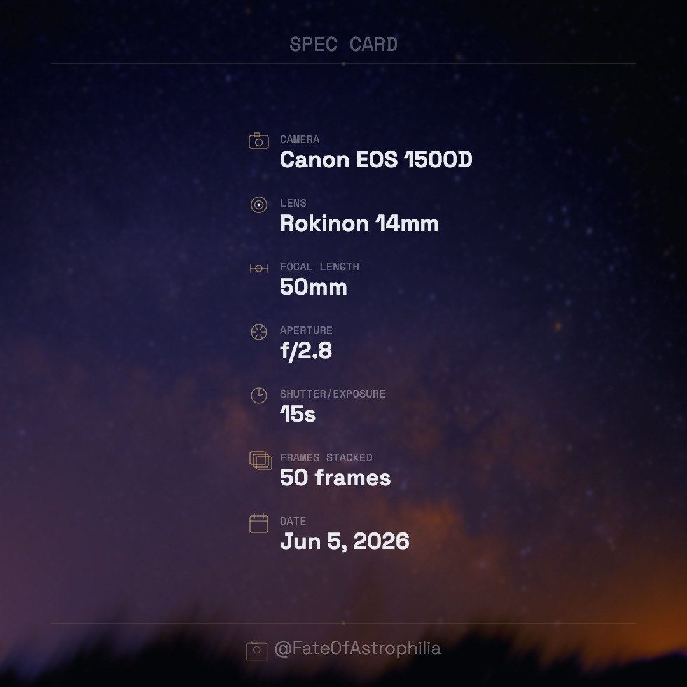

# Camera Spec Card Generator

**Turn any photo or Siril FITS file into a shareable camera spec card.**

Drop your image, get a beautifully formatted 1080×1080 overlay with your shooting data — no account, no upload, no server. Just one HTML file.

🔗 **[Try it live → justinoros.github.io/spec-card](http://justinoros.github.io/spec-card)**

---



---

## Features

- **Drag & drop or browse** — JPEG, PNG, TIFF, CR2 RAW, and FITS files
- **Auto-reads metadata** — EXIF for camera photos, FITS headers for Siril exports
- **Astrophotography fields** — camera, telescope, lens, focal length, aperture, filter, shutter, frames stacked, total integration, ISO/gain, object, location, Bortle scale, and date
- **Smart background handling** — images without EXIF data are used as the card background without overwriting your spec fields
- **Click any field on the card** to edit it inline, or use the edit panel below
- **Live updates** — every keystroke instantly re-renders the card
- **Two-column layout** — automatically activates when 8+ fields are populated
- **Text size and background blur sliders**
- **Custom icon and text colors** via hex input
- **Editable header and footer** — swap "SPEC CARD" for your target name, and the footer for your IG handle, YouTube, or website
- **Downloads as a timestamped 1080×1080 JPEG** — `camera-spec-card-YYYYMMDD-HHMMSS.jpg`
- **Zero dependencies at runtime** — everything runs in the browser, nothing is sent to a server

---

## Usage

### Option 1 — Use the hosted version
Visit **[justinoros.github.io/spec-card](http://justinoros.github.io/spec-card)** — no installation needed.

### Option 2 — Self-host or run locally
1. Clone or download this repo
2. Place your own background image as `bg.jpg` in the same folder (optional)
3. Open `index.html` in any modern browser — that's it

```
spec-card/
├── index.html   ← the entire app
└── bg.jpg       ← background wallpaper (optional, replace with your own)
```

---

## Supported File Types

| Format | Metadata Source | Image Preview |
|--------|----------------|---------------|
| JPEG / PNG | EXIF | ✅ Used as card background |
| TIFF (8-bit / 16-bit) | TIFF IFD tags | ✅ Used as card background |
| CR2 / CR3 RAW | Embedded EXIF | ✅ Embedded JPEG preview extracted |
| FITS / FIT | FITS header keywords | ❌ Gradient placeholder (drop a separate image to set background) |

> **TIFF note:** 32-bit float TIFFs (Siril's default linear export) are not supported. Export as 16-bit or 8-bit TIFF from Siril before use.

---

## FITS Keywords Read

When a `.fit` or `.fits` file is loaded, the following header keywords are extracted automatically:

| Card Field | FITS Keywords |
|---|---|
| Camera | `INSTRUME` |
| Lens | `LENS`, `OPTICS` |
| Focal Length | `FOCALLEN`, `FOCAL` |
| Aperture | `FOCRATIO`, `APERTURE` |
| Filter | `FILTER`, `FILT` |
| Shutter / Exposure | `EXPTIME`, `EXPOSURE` |
| Frames Stacked | `STACKCNT`, `NCOMBINE`, `NFRAMES` |
| Total Integration | `TOTALEXP` |
| ISO / Gain | `ISO`, `GAIN` |
| Object | `OBJECT`, `TARGET` |
| Location | `SITELAT` + `SITELONG` |
| Bortle Scale | `BORTLE`, `SQMVALUE` |
| Date | `DATE-OBS`, `DATE` |

Any fields not present in the file can be filled in manually using the edit panel.

---

## Recommended Workflow for Astrophotography

1. **Drop your background image** (exported PNG/TIFF from Siril, or any photo) — used as the blurred background
2. **Drop your FITS file** — populates all available spec data without replacing the background
3. **Fill in any missing fields** in the edit panel (Bortle, location, total integration, etc.)
4. **Adjust** text size, blur, and colors to taste
5. **Download** your 1080×1080 spec card and share alongside your image

---

## Customization

All fields on the card are editable — tap directly on the card or use the panel below it:

- **Header** — defaults to `SPEC CARD`, change to your target name or session title
- **Footer** — defaults to `@FateOfAstrophilia`, change to your IG, YouTube, website, or anything
- **Icon color** — any 6-digit hex (default `#c8a96e`)
- **Text color** — any 6-digit hex (default `#e8eaf0`)
- **Text size** — slider from 60% to 140%
- **Background blur** — slider from 0px (sharp) to 60px

---

## Built With

- Vanilla HTML, CSS, and JavaScript — no framework, no build step
- [EXIF.js](https://github.com/exif-js/exif-js) — JPEG/PNG EXIF parsing
- [UTIF2](https://github.com/photopea/UTIF.js) — TIFF decoding
- Custom binary EXIF parser for CR2 RAW files
- Custom FITS header parser

---

## License

MIT — free to use, fork, and modify.

---

*Made with ❤️ by [Justin Oros](https://www.instagram.com/FateOfAstrophilia) · [@FateOfAstrophilia](https://www.instagram.com/FateOfAstrophilia)*
